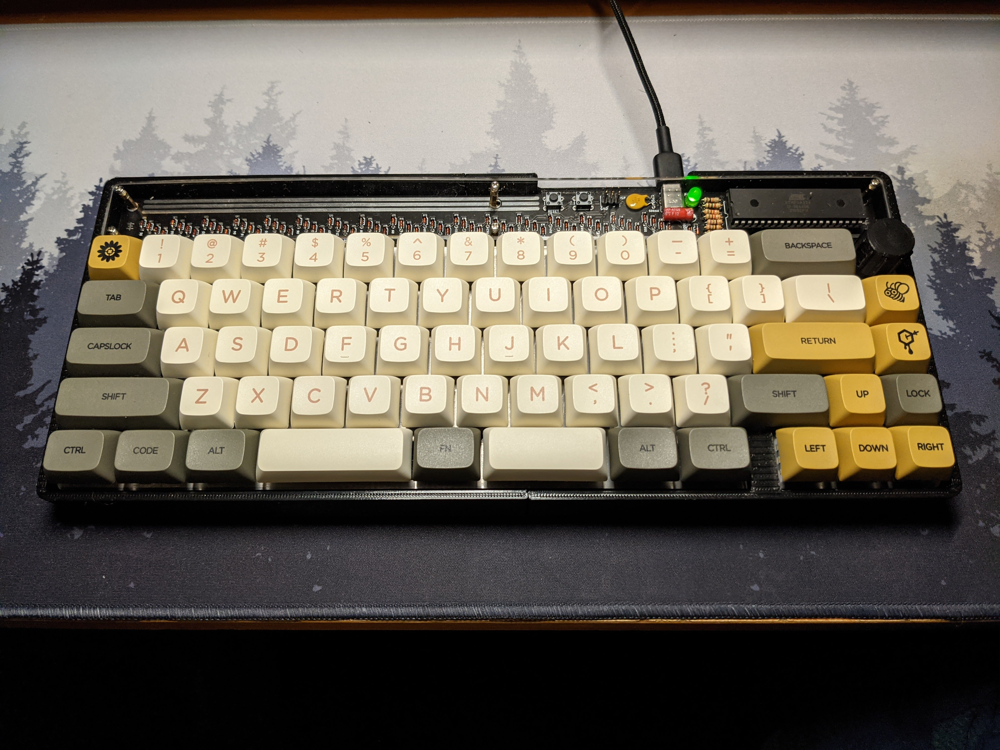

# Kenneth's keymap for his modified Discipline board.

**Created Aug. 2021**

This version of CFTKB's Discipline board adds a split spacebar and an encoder on the upper right. Board level files have been changed to add support for this. The build also includes a 3D printed case, a 3D printed knob, Mill Max hot-swap sockets, and blanket-like fabric for sound dampening. But that has nothing to do with the code :slightly_smiling_face:.

This board mostly has the same features as my DZ60 board, except for RGB lighting and the encoder.

No pictures of the layers because the layout is custom and is not available in the QMK Configurator where I get my pictures. :disappointed: I will put 1 picture of my board, though.

### Features

There are four layers: the **base** layer, **function** layer, **mouse** layer, and **locked** layer.
 
 **Base** layer:
 - the standard 65% keys
 - space on left spacebar
 - backspace on right spacebar and its usual spot
 - grave/esc key so you can press ~ like usual and use esc easily with ctrl override so ctrl-shift-esc combo works
 - volume control on encoder (Kinda finnicky. Will sometimes do way too much scrolling on one detent. The connection is good, so I don't think it's that.)
 
**Function** layer:
 - accessed through middle space key
 - FN keys on the number row
 - delete on backspace
 - home, end, page up, and page down on arrow keys
 - the ` key
 - standard modifiers (shift, alt, etc.) in their usual spots
 - media skip/previous on encoder

**Calculator** layer:
 - numbers on 'zxcv sdf wer' for '0123 456 789'
 - symbols on number row
 - '.' on 'b'
 - space, backspace, esc, enter still available
 - open calculator app on tab

**Mouse** layer:
 - movement on WASD
 - left click on E, right click on Q, scroll click on 2
 - previous, forward buttons on 1, 3
 - CTRL key still available while layer is on
 - vertical and horizontal scrolling with WASD and holding the center modifier key (the button that activates the function layer)
 - layer used with toggle instead of hold
 - speed or slow the cursor with space and shift respectively

**Locked** layer:
 - all keys are disabled except for the key to exit the layer
 - toggled by fn+\