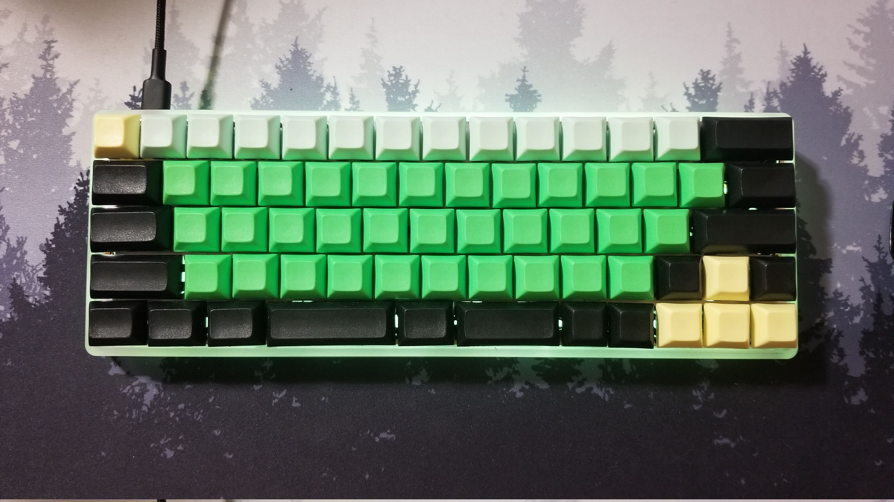
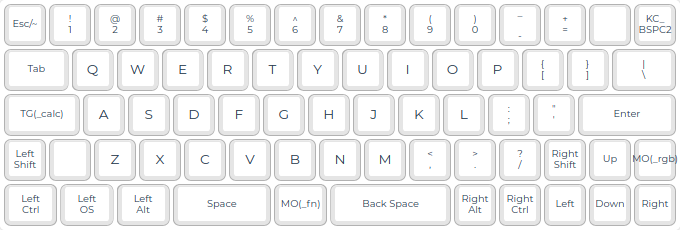
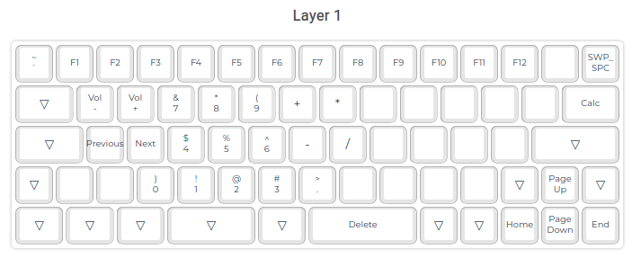
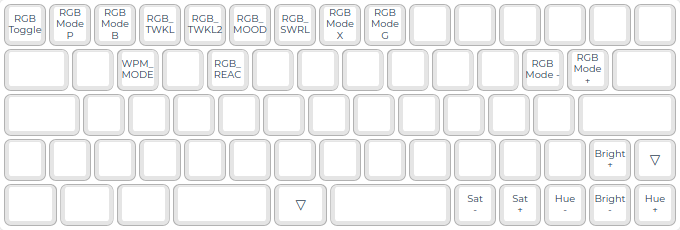

# Kenneth Seneres's Personal Keymap

**Created Jul. 11, 2020.**

*This is a fork of the QMK Firmware repository. Thank you to the QMK team and their contributors for building this foundation and providing good documentation of their open-source project.*

This keymap is for my DZ60 custom keyboard. This 60% keyboard splits spacebar into three different keys and has arrow keys.

### Features

There are five layers: the **base** layer, **function** layer, **RGB** layer, **mouse** layer, and **locked** layer. Custom features include lighting indicators for caps lock and the function layer, lighting indicator when pressing the wrong backspace, cycling through custom static RGB colors, keycodes for lighting animations that didn't have them, and a WPM mode that runs the snake lighting animation at different speeds depending on your calculated words per minute.

I've written a keymap.c to json converter here! Whenever you make changes to the keymap, use this and upload it to the QMK Configurator so you can generate pictures of the new keymap. 
Step by step moves when you do an edit of the layout:
 1. edit keymap.c
 2. run the python script
 3. upload the JSON output to [QMK Configurator](https://config.qmk.fm/)
 4. use the "print keymap layers" tool to grab pictures of the changes
 5. name the picture the same as the picture of the layer you're changing

Feature: fn+backspace (on upper right) now swaps the positions of the space and backspace keys on the bottom row to accommodate right-handed people.
Feature: mouse layer where capslock usually sits on toggle. Mouse movement on WASD, clicking on QER, scrolling by holding the center modifier button and using WASD.

Feature: Numpad is now for the left hand.
Feature: You can now turn the bright red light for backspace on/off by pressing Fn+Backspace.

New: The "swap space" feature is now performed by pressing space+fn+backspace.
New: The calculator feature has been moved to its own layer. It's toggled on by the caps lock key.
New: The mouse layer has been adjusted so that the shift and ctrl keys slow and speed up the cursor instead of jkl for one-handed use. It also has new lighting.
New: A locked layer where almost all keys do nothing so you can test how the switches feel without unplugging the board. It has its own lighting style.
New: There are now less RGB modes to scroll through. Mostly just removed the...ugly...ones and made it so animations only run at one speed.

**Base** layer:
 - the standard QWERTY keys
 - arrow keys
 - space on left spacebar
 - backspace on right spacebar and its usual spot
 - grave/esc key so you can press ~ like usual and use esc easily
 - right shift, alt, ctrl
 

 
**Function** layer:
 - FN keys on the number row
 - delete on backspace
 - media controls on wasd keys
 - home, end, page up, and page down on arrow keys
 - the ` key
 - standard modifiers (shift, alt, etc.) in their usual spots
 

**Calculator** layer:
 - numbers on 'zxcv sdf wer' for '0123 456 789'
 - symbols on number row
 - '.' on 'b'
 - space and backspace still available
 - open calculator app on tab

**Mouse** layer:
 - movement on WASD
 - left click on E, right click on Q, scroll click on R
 - CTRL key still available while layer is on
 - vertical and horizontal scrolling with WASD and holding the center modifier key (the button that activates the function layer)
 - layer used with toggle instead of hold
 - speed or slow the cursor with space and shift respectively

**RGB** layer: 
 - lighting modes on number row
    - plain, breathing, rainbow mood, rainbow swirl, snake, knight,
     christmas, static gradient, test, alternating, twinkle
 - plain mode cycles through 4 different colors
    - green, amber, purple, blue
 - adjust the plain color in HSV using left-right for hue, right alt and right control for saturation, and up-down for value
 - WPM lighting mode on 'w'

**Locked** layer:
 - all keys are disabled except for the key to exit the layer
 - toggled by fn+\

### Pipe dream features
 - Use the RGB breathing effect when computer is asleep.
 - A mode where the keyboard can teach you which key is which. Like, it'll tell you what the key you just pressed does.
 - A per key lighting hack where one random LED breathes every time you press a key.

### Planned features
 - Implement "swap space" with the "process_record_user" method instead of the "extra layers" method.
