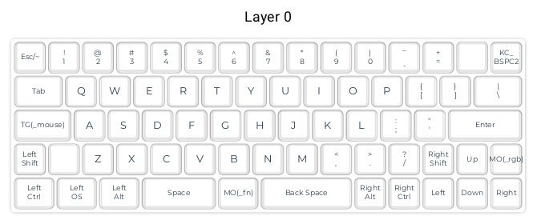
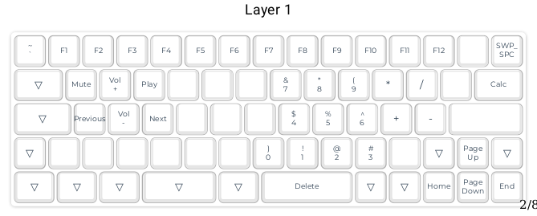
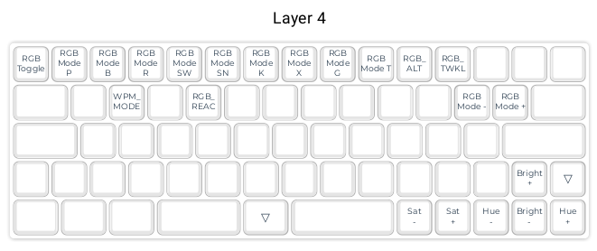

# Kenneth Seneres's Personal Keymap

**Created Jul. 11, 2020.**

*This is a fork of the QMK Firmware repository. Thank you to the QMK team and their contributors for building this foundation and providing good documentation of their open-source project.*

This keymap is for my DZ60 custom keyboard. This 60% keyboard splits spacebar into three different keys and has arrow keys.

### Features

There are three layers: the **base** layer, **function** layer, and **RGB** layer. Custom features include lighting indicators for caps lock and the function layer, lighting indicator when pressing the wrong backspace, cycling through custom static RGB colors, keycodes for lighting animations that didn't have them, and a WPM mode that runs the snake lighting animation at different speeds depending on your calculated words per minute.

**Base** layer:
 - the standard QWERTY keys
 - arrow keys
 - space on left spacebar
 - backspace on right spacebar and its usual spot
 - grave/esc key so you can press ~ like usual and use esc easily
 - right shift, alt, ctrl
 

 
**Function** layer:
 - FN keys on the number row
 - delete on backspace
 - media controls on qwerty keys
 - home, end, page up, and page down on arrow keys
 - the ` key
 - numpad centered on 'k' with
    - 0 is on n
    - plus, minus, multiply, and divide symbols on ;'p[ 
 - standard modifiers (shift, alt, etc.) in their usual spots
 

**RGB** layer: 
 - lighting modes on number row
    - plain, breathing, rainbow mood, rainbow swirl, snake, knight,
     christmas, static gradient, test, alternating, twinkle
 - plain mode cycles through 4 different colors
    - green, amber, purple, blue
 - adjust the plain color in HSV using left-right for hue, right alt and right control for saturation, and up-down for value
 - WPM lighting mode on 'w'
 

### Pipe dream features
 - Use the RGB breathing effect when computer is asleep.
 - A mode where the keyboard can teach you which key is which. Like, it'll tell you what the key you just pressed does.
 - A per key lighting hack where one random LED breathes every time you press a key.
